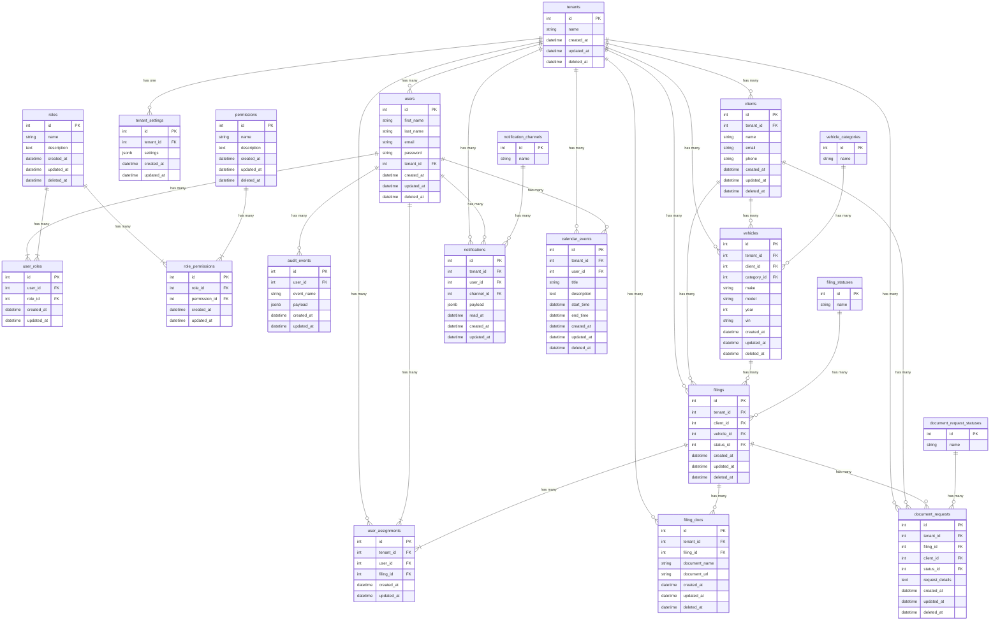

# Database Schema Documentation

## ER Diagram

## Relational Notes

### Tenancy
- The `tenants` table is the root of the tenancy model.
- Most tables have a `tenant_id` column to scope data to a specific tenant.
- `users`, `clients`, `vehicles`, `filings`, etc. are all scoped to a tenant.

### Users and Permissions
- Users are associated with a tenant.
- `roles` and `permissions` are defined globally.
- `user_roles` is a join table for the many-to-many relationship between users and roles.
- `role_permissions` is a join table for the many-to-many relationship between roles and permissions.

### Filings and Documents
- `filings` are associated with a `client` and a `vehicle`.
- `filing_docs` stores documents related to a specific filing.
- `user_assignments` links users to filings, indicating responsibility.
- `document_requests` are initiated for a `filing` and a `client`.

### Enums and Statuses
- `vehicle_categories`, `filing_statuses`, `notification_channels`, and `document_request_statuses` are enum tables to enforce constraints and provide a single source of truth for these values.

### Soft Deletes
- Most tables have a `deleted_at` column to enable soft deletes. This allows for data to be recovered if accidentally deleted.

### Auditing
- `audit_events` logs user actions for security and compliance purposes. It is linked to the `users` table.

### Indexes and Constraints
- Foreign key constraints are used to maintain relational integrity.
- Unique constraints are used on columns like `email` in the `users` and `clients` tables (scoped to `tenant_id`), and `name` in the enum tables.
- Indexes are created on foreign key columns and other frequently queried columns to improve performance.
- GIN indexes are recommended for `jsonb` columns like `settings` in `tenant_settings` and `payload` in `audit_events` and `notifications`. I have not added them in the migrations as they are not supported by all versions of postgresql, but they should be considered for performance.
